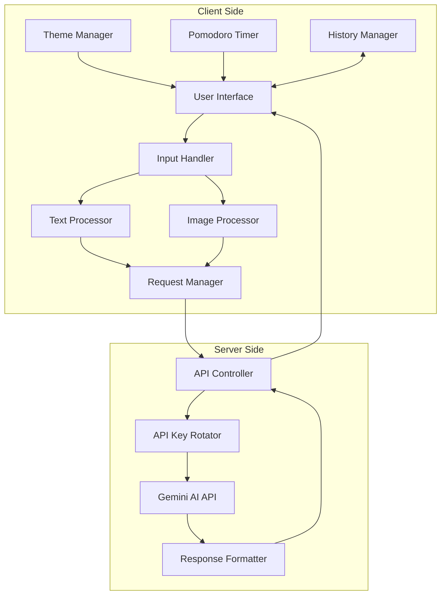
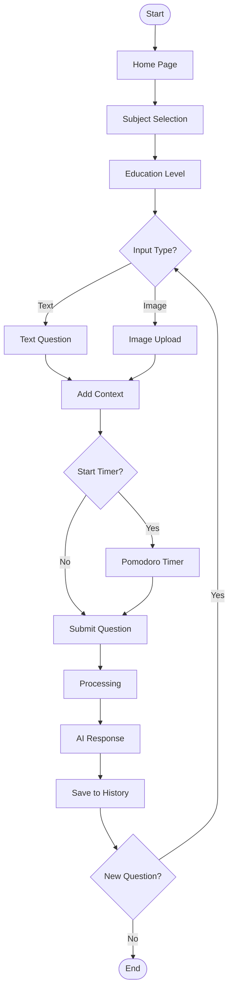
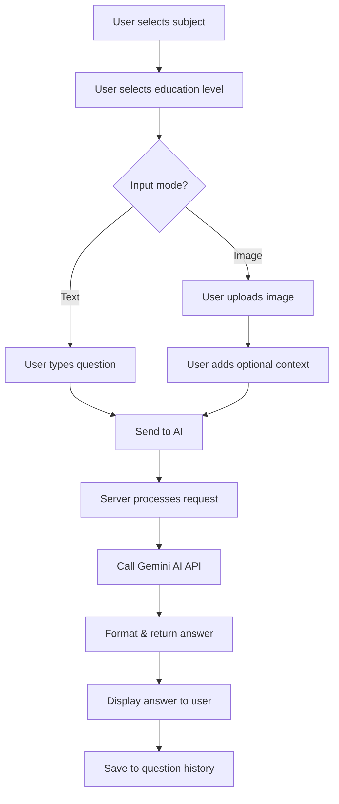
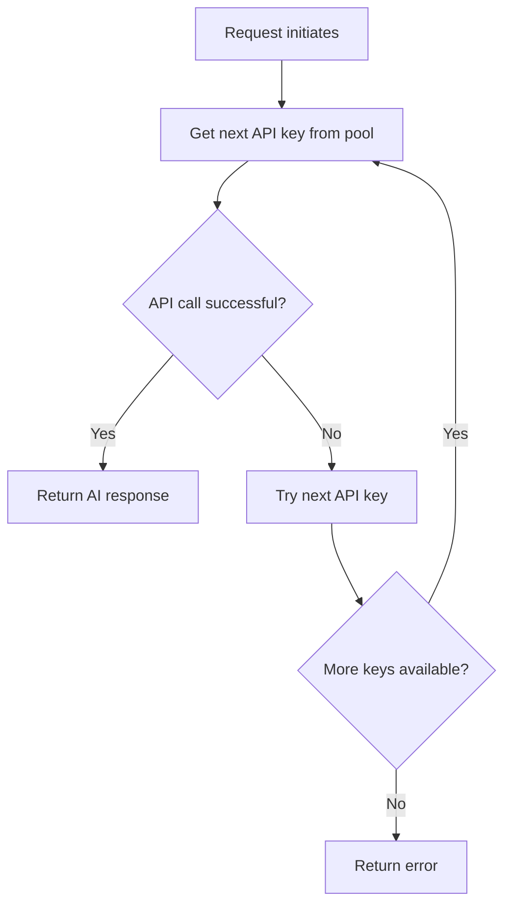

# 🎓 Student Brain Booster

 


<p align="center">
  
</p>

## 📚 Overview

Student Brain Booster is an interactive AI-powered educational tool designed to help students of all educational levels with their academic questions. It leverages Google's Gemini AI to provide intelligent answers tailored to specific subjects and educational levels, enabling personalized learning assistance on demand.

This application features a modern, responsive UI with theme support, a Pomodoro timer for focused study sessions, and both text and image-based question handling capabilities. Student Brain Booster is perfect for students seeking quick clarification on concepts, solving complex problems, or getting help with homework across various subjects.

---

## ✨ Features

### 🤖 AI-Powered Assistance
- **Subject-Specific Help**: Get tailored answers for 14+ academic subjects
- **Education Level Customization**: Adjust responses to match primary school through college level
- **Text & Image Questions**: Upload images of handwritten problems or textbook questions
- **Structured Responses**: Receive clear, well-organized answers with key points and memory tips

### ⏱️ Productivity Tools
- **Built-in Pomodoro Timer**: 25-minute focus sessions followed by 5-minute breaks
- **Study Statistics**: Track questions answered and total study time
- **Question History**: Access previously asked questions for review

### 🎨 User Experience
- **Dark/Light Theme**: Choose your preferred visual mode
- **Responsive Design**: Works seamlessly on desktop, tablet, and mobile devices
- **Animations & Effects**: Engaging interactive elements enhance user experience
- **Accessibility Features**: Designed with accessibility in mind

---

## 🛠️ Tech Stack

- **Framework**: [Next.js 14](https://nextjs.org/)
- **UI Components**: [Shadcn UI](https://ui.shadcn.com/)
- **Styling**: [Tailwind CSS](https://tailwindcss.com/)
- **AI Integration**: [Google Gemini 1.5 Flash API](https://ai.google.dev/)
- **State Management**: React Hooks & Context
- **Form Handling**: React Hook Form
- **Animations**: CSS Animations & Transitions

---

## 📋 Prerequisites

Before you begin, ensure you have:

- [Node.js](https://nodejs.org/) (v18 or newer)
- [npm](https://www.npmjs.com/), [yarn](https://yarnpkg.com/), or [pnpm](https://pnpm.io/)
- [Google Gemini API Key(s)](https://makersuite.google.com/)

---

## 🚀 Installation

1. **Clone the repository**
   ```bash
   git clone https://github.com/yourusername/student-brain-booster.git
   cd student-brain-booster
   ```

2. **Install dependencies**
   ```bash
   # Using npm
   npm install

   # Using yarn
   yarn install

   # Using pnpm
   pnpm install
   ```

3. **Set up environment variables**

   Create a `.env.local` file in the root directory with:
   ```
   GEMINI_API_KEY_1=your_gemini_api_key_here
   # Optional additional keys for rotation
   GEMINI_API_KEY_2=your_backup_key_1
   GEMINI_API_KEY_3=your_backup_key_2
   GEMINI_API_KEY_4=your_backup_key_3
   ```

4. **Start the development server**
   ```bash
   # Using npm
   npm run dev

   # Using yarn
   yarn dev

   # Using pnpm
   pnpm dev
   ```

5. **Open your browser**
   
   Navigate to [http://localhost:3000](http://localhost:3000)

---

## 🔄 Core Workflow

### 📊 System Architecture



### 🔄 User Session Flow



### 🤖 AI Question-Answer Flow



### 🔑 API Key Rotation System



---

## 🧩 Main Components

### 1. Question Interface

- Subject selection with visual cards
- Education level dropdown
- Text/image input toggle
- Image upload with preview and compression
- AI request and response handling

### 2. Pomodoro Timer

- 25-minute focus sessions
- 5-minute break intervals
- Visual progress tracking
- Session statistics

### 3. Question History

- Local storage of previous questions
- Quick access to frequently asked questions
- One-click reuse of previous questions

### 4. Theme System

- Light/dark mode toggle
- Persisted user preference
- System preference detection

---

## 🔐 Data Privacy

- All question data is stored locally on your device
- No user data is sent to servers except questions and images for AI processing
- Images are compressed client-side before transmission
- No registration or login required

---

## 📱 Mobile Experience

Student Brain Booster is fully responsive and optimized for mobile devices:

- Adaptive layouts for different screen sizes
- Touch-friendly interface elements
- Optimized image handling for mobile bandwidth

---

## 🔧 Advanced Customization

### Environment Variables

| Variable | Description | Required |
|----------|-------------|----------|
| GEMINI_API_KEY_1 | Primary Gemini API key | Yes |
| GEMINI_API_KEY_2-4 | Backup API keys for rotation | No |

### Image Compression

You can adjust image compression settings in the `utils.ts` file:

- `maxWidth`: Maximum image dimension (default: 512px)
- `quality`: JPEG compression quality (default: 0.6)

---

## 🤝 Contributing

Contributions are welcome! Please feel free to submit a Pull Request.

1. Fork the repository
2. Create your feature branch (`git checkout -b feature/amazing-feature`)
3. Commit your changes (`git commit -m 'Add some amazing feature'`)
4. Push to the branch (`git push origin feature/amazing-feature`)
5. Open a Pull Request

---

## 📄 License

This project is licensed under the MIT License - see the LICENSE file for details.

---

## 👏 Acknowledgements

- [Next.js](https://nextjs.org/) - The React Framework
- [Tailwind CSS](https://tailwindcss.com/) - A utility-first CSS framework
- [shadcn/ui](https://ui.shadcn.com/) - UI components
- [Google Gemini AI](https://deepmind.google/technologies/gemini/) - AI model
- [Lucide Icons](https://lucide.dev/) - Beautiful icons

---

---

> **Built with ❤️ for students everywhere**
